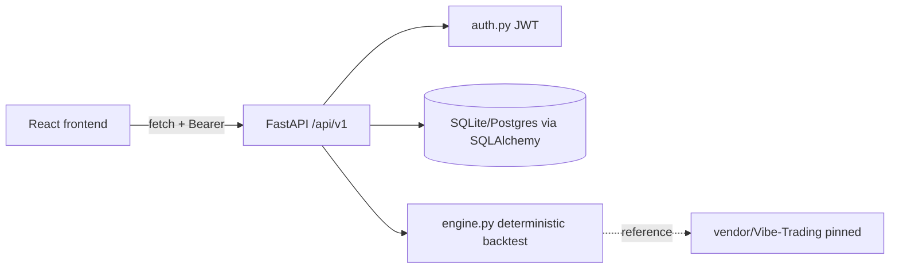

# Architecture

```mermaid
flowchart LR
  FE[React frontend] -->|fetch + Bearer| API[FastAPI /api/v1]
  API --> Auth[auth.py JWT]
  API --> DB[(SQLite/Postgres via SQLAlchemy)]
  API --> ENG[engine.py deterministic backtest]
  ENG -. reference .-> VEN[vendor/Vibe-Trading pinned]
```
